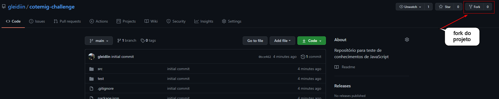

# Cotemig Challenge 

Seja bem-vindo ao repositório contemig challenge, aqui você aluno terá um grande desafio.

Estamos com vários problemas em nossos testes unitários e gostariamos muito da sua ajuda para resolve-lós.

Temos várias definições de funções e seus testes unitários completos, sua missão é implementar essas funções e deixar o teste unitário verdinho! 

O que preciso para ajudar? Preciso de seus conhecimentos de:

- Lógica de Programação;
- Algoritmos;
- Javascript;
- CSS;
- HTML.

E os prolemas que temos para  resolver estão dentro da pasta `src`.

Boa sorte e qualquer problema, abre uma issue pra gente. :)

### Como Começar

Faça um fork desse projeto clicando no botão:



E logo ele irá aparecer dentro do seu respositório, faça as correções e valide se tudo funciona.


### Como testar?

Precisamos que tenha node instalado no seu computador, assim como npm ou yarn.
Assim que baixar o projeto, instale e configure com os seguintes comandos:

```
npm install
```

E valide o funcionamento do seu projeto com:

```
npm run test
```

Terminou?

### Terminei, envio um PR? 

Isso, valide primeiro se não tem novos itens, você consegue sincronizar nosso repositório com o seu fork utilizando:

```
git remote add original https://github.com/gleidiin/cotemig-challenge.git
git pull original main
```

Você não precisa nos enviar uma resposta, mas sim um print dos testes funcionando. 
E se possível, gostariamos que você adiciona-se outro desafio para seus amigos! 

### Adicionando novo teste:

Primeiramente, seria legal ter tudo documentado, então descreve como sua função deveria funcionar usando a [documentação para documentações](https://jsdoc.app/). 

Feito isso, envie para nos, com exemplos e iremos validar a complexidade da função. :) 

